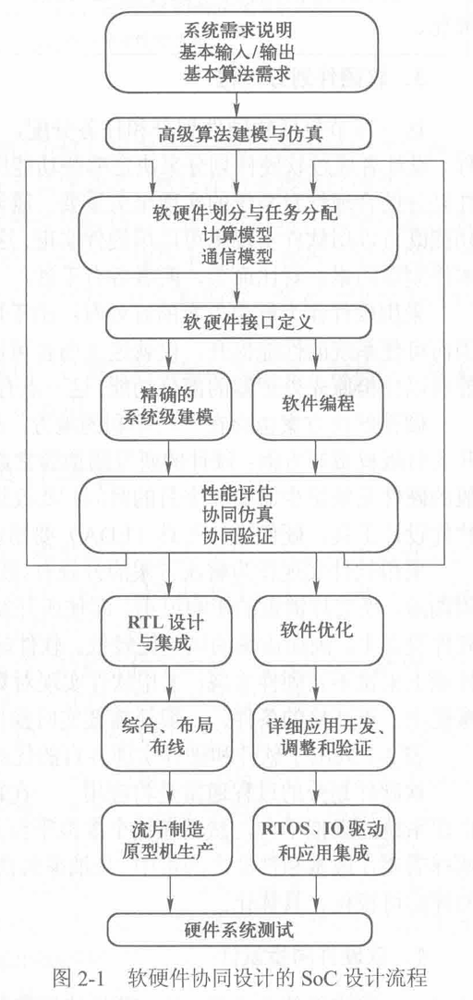

# SoC设计流程

> [!note]
>
> 1. SoC设计需要了解整个系统的应用，定义出合理的芯片架构，使得软硬件配合达到系统最佳工作状态
> 2. SoC设计是以**IP复用**为基础

## 软硬件协同设计

软硬件协同设计：软硬件设计同步进行

> 硬件：SoC芯片部分
>
> 软件：运行在SoC芯片上的系统及应用程序

1. 系统需求说明

   > 确定所需的功能：系统基本输入和输出及基本算法需求，系统功能、性能、功耗、成本和开发时间
   >
   > 将用户需求转换为用于设计的设计文档，初步确定系统设计流程

2. 高级算法建模和仿真

   > 使用高级语言创建整个系统的高级算法模型和仿真模型

3. 软硬件划分过程

   > 通过软硬件划分决定哪些功能由硬件实现，哪些功能由软件实现
   >
   > 
   >
   > 过程中，将应用在特定系统架构上映射，建立系统的事务级模型，即搭建系统的虚拟平台

4. 软硬件同步设计

   > 硬件设计：RTL设计和集成、综合、布局布线及最后的流片
   >
   > 软件设计：算法优化、应用开发，以及操作系统、接口驱动和应用软件的开发

5. 硬件系统测试

   > 系统测试策略根据设计层次结构制定的
   >
   > 首先测试子模块的正确性，接着是子模块的接口及总线
   >
   > 最后运行实际的应用软件或者测试平台

- 协同设计的关键是在抽象级的系统建模

## 基于标准单元的SoC芯片设计流程

- SoC设计是从整个系统的角度出发，把处理机制、模型算法、芯片结构、各层次电路直至器件的设计紧密结合起来
- 
